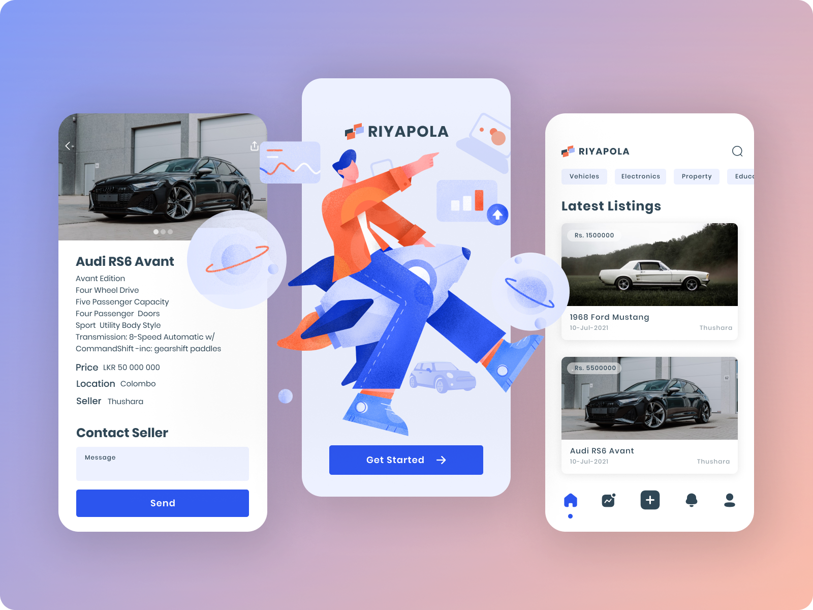

# RIYAPOLA Mobile App - Redesign

Our goal in this project is to improve the Riyapola mobile application which we previously selected as our use case. We intent to add more user-friendly interfaces & functionalities to this particular application in this project. Riyapola is an advertising mobile application which can be used by both sellers and buyers. Sellers can sell their items by posting an advertisement about their items to the app while buyers can search through the items using advanced search option & buy their preferred selling items from the advertisements by contacting the seller.

Current version of this application contains login in, sign up, account management, advertisement management, advance filter & theming functionalities. Even though there are many functionalities most of them not working properly. Even the user validations and email validations not functioning well. There are three navigation bars available in the app and user get confused with the question which one to use.

We are planning to fix these issues and make it more user friendly. In our user research, we are looking for two sorts of users to find out how they feel by using the app. This will also assist us in determining if any more upgrades are required. Alternatively, whether the user has a positive experience with the application

#### NOTE❗: This project is developed just for assignment purposes.

## Group Details

Member Details

| Name                   | Student ID |         Username |
| ---------------------- | :--------: | ---------------: |
| Jayasith H. B. C       | IT19079264 |         jayasith |
| Thiwanka K. A. T       | IT19076362 | thusharathiwanka |
| Weerasinghe D. N. H    | IT19070704 |         hasansin |
| Onella Natalie P. A. D | IT19041926 |    OnellaNatalie |

## Technologies

  

## Getting Started

### Prerequisites

- Node JS should be installed
- Android/iOS Emulator or Phone with Expo Go app installed

### Running the project

- In the project directory, you can run below commands to install the dependencies and run the app:

  1. ### `cd api && npm install` - install backend dependencies
  2. ### `npm install` - install react native dependencies
  3. ### `cd api && npm start` - start the backend server
  4. ### `npm start` - start the react native app in expo development server

Read the [expo documentation](https://docs.expo.dev/workflow/expo-cli/) to learn more.

### Available Scripts

In the project directory, you can run:

### `npm start`

Runs the app in the development mode in the browser.\
Open [http://localhost:3000](http://localhost:19000) to view it in your browser.

In the api directory, you can run:

### `npm start`

Runs the backend server.\
Open [http://localhost:5000](http://localhost:5000) to view it in your browser.

### `npm run watch`

Runs the backend server on development mode.\
Open [http://localhost:5000](http://localhost:5000) to view it in your browser.
